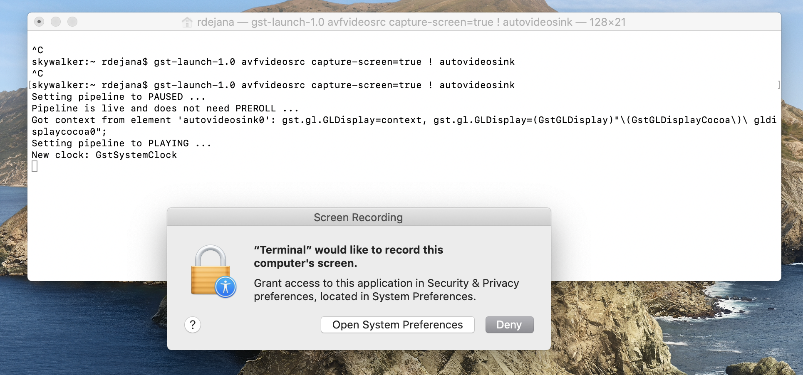
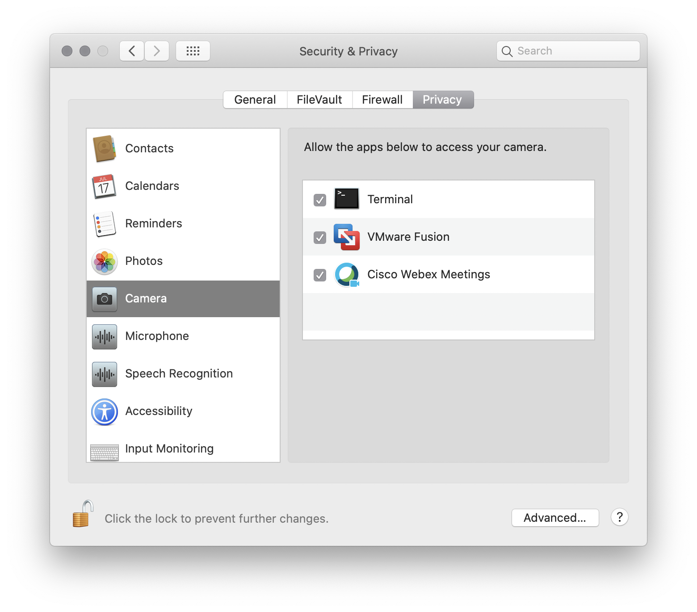
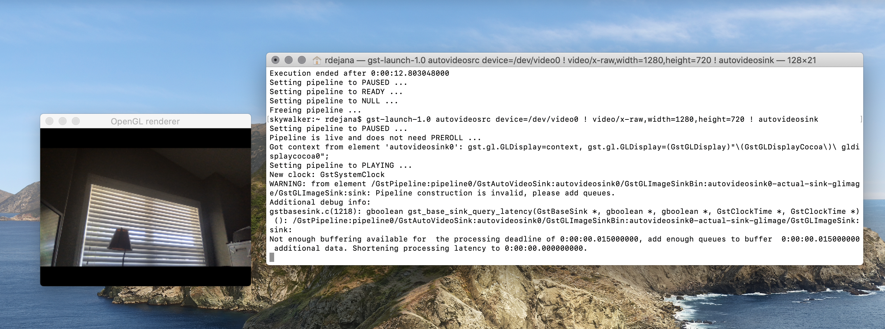
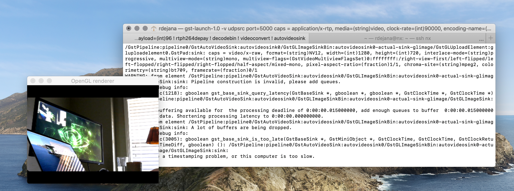
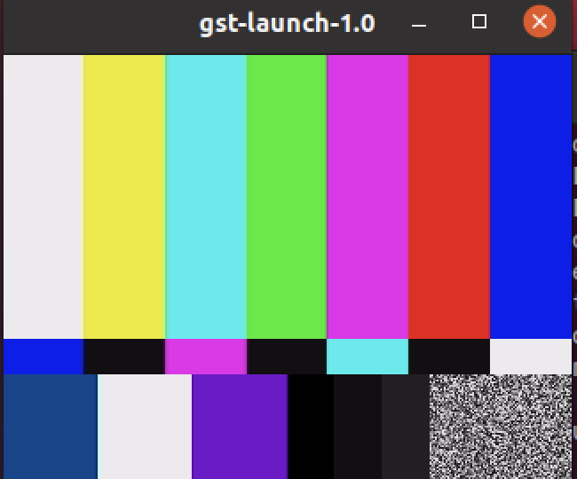
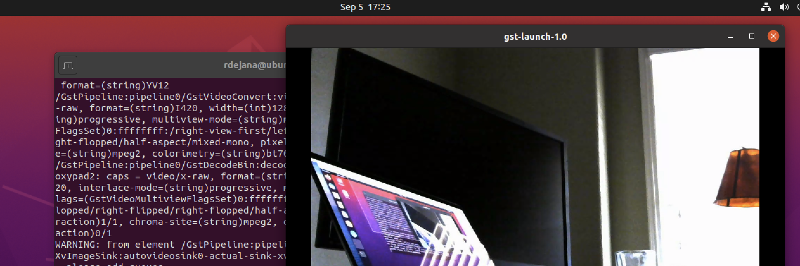

# GStreamer
GStreamer is a framework for creating streaming media applications and is part of the Nvidia's l4t distribution.  It may be used to capture and transform camera into or to stream video from the Jetson device. In GStreamer, media is manipulated via a series of transformations/pipeline.  GStreamer can be used to stream and display content from your Jetson devices for applications that require additional X Windows extensions that may not be present on your workstation.

This section will share some approaches to using GStreamer to stream content to and from your Jetson.  As with the X Windows section, the exmaples will cover macOS and Linux.

Note of these examples are optimized.

## MacOS
You'll be using Homebrew to install GStreamer.  As an alternative, you may following the intructions [here](https://gstreamer.freedesktop.org/documentation/installing/on-mac-osx.html?gi-language=c).

### Installing Homebrew
If Homebrew is not installed, follow the instructions on the [Homebrew website](https://brew.sh)

### Installing GStreamer with brew
Once Homebrew is installed, running the following command in a terminal to install GStreamer `brew install gstreamer gst-plugins-base gst-plugins-good gst-plugins-bad gst-plugins-ugly gst-libav`.

### Verification examples
The following examples may be used to verify that GStream is running correctly.
#### Stream Desktop
This example will stream you desktop to a window running locally.

In a terminal, run the command: `gst-launch-1.0 avfvideosrc capture-screen=true ! autovideosink`

Note, you may asked to grant permission for terminal to record your screen.  Grant it.



You'll need to quit and run the command again.  This time you should see something similar to:


#### Stream Camera
This example will stream your camera to a local window.

In a terminal, run the command: `gst-launch-1.0 autovideosrc device=/dev/video0 ! video/x-raw,width=1280,height=720 ! autovideosink`

Note, you may  be asked to grant permission for terminal to access your camera.  Grant it.



You'll need to quit and run the command again.  This time you should see something similar to:



you can adjust the brightness as well by adding the gamma pipeline.
 Making it lighter
 ```
 gst-launch-1.0 autovideosrc device=/dev/video0 ! video/x-raw,width=1280,height=720 ! gamma gamma=2.0 ! autovideosink
 ```
 
 or darker
 ```
 gst-launch-1.0 autovideosrc device=/dev/video0 ! video/x-raw,width=1280,height=720 ! gamma gamma=0.5 ! autovideosink
 ```

### Streaming to and from the Jetson when using Jetson-Infernce
The [Jetson-Infernce ](https://github.com/dusty-nv/jetson-inference) project supports streaming video feeds and images via a variety of interfaces and protocols including the ablity to read from or stream to Gstreamer. The following examples require that either Jetson-Infernce be installed or that you are using the Jetson-Infernce containe image.

All of the Jetson-Inference commands work the same, but for this example, we'll be using the command `video-viewer`.  

In these examples you'll need the IP address of your workstation, $macIP, along with your Jetson's IP, $jetsonIP.  Replace the example IP addresses used below with your actual IP addresses.

Sample $macIP = 192.168.1.199
Sample $jetsonIP = 192.168.1.116

#### Stream from Jetson
- Start a shell on your Jetson, either from SSH or from the deskstop.  Running the following command, adjusting your video device as needed (this example as the USB camera as device 1) and replacing the sample IP with your workstations actual IP address.
```
video-viewer /dev/video1 rtp://192.168.1.199:5000
```
- From a terminal on your mac, run the following command
```
gst-launch-1.0 -v udpsrc port=5000 caps = "application/x-rtp, media=(string)video, clock-rate=(int)900, encoding-name=(string)H264, payload=(int)96" ! rtph264depay ! decodebin ! videoconvert ! autovideosink
```
You'll see a window displayed on your mac displaying the output from your Jetson's camera.  Note, if you are logged into your Jetson's desktop, you'll see the same content displayed on a window there as well.



#### Stream Mac Camera to Jetson
- From a terminal on your mac, running the following command, remembering to replace the IP with your Jetson's: 
```
gst-launch-1.0 autovideosrc device=/dev/video0 ! "video/x-raw"  ! videoscale ! videoconvert ! x264enc tune=zerolatency bitrate=500 speed-preset=superfast ! rtph264pay ! udpsink host=192.168.1.116 port=5000
```
- From a shell on the Jetson desktop, run the command: 
```
video-viewer --input-codec=h264 rtp://192.168.1.116:5000
```
You should see your mac's camera output displayed on your Jetson's desktop.


#### Stream Mac Camera to Jetson and back to Mac for Display
This example streams the camera from your mac, to the Jetson for processing, and finally displays it on your mac.

- From a terminal on your mac, running the following command, remembering to replace the IP with your Jetson's: 
```
gst-launch-1.0 autovideosrc device=/dev/video0 ! "video/x-raw"  ! videoscale ! videoconvert ! x264enc tune=zerolatency bitrate=500 speed-preset=superfast ! rtph264pay ! udpsink host=192.168.1.116 port=5000
```
- From a shell on the Jetson desktop, run the command: 
```
video-viewer --input-codec=h264 rtp://192.168.1.116:5000 rtp://192.168.1.199:5000
```
- And finally, from a second terminal on your mac, run:
```
gst-launch-1.0 -v udpsrc port=5000 caps = "application/x-rtp, media=(string)video, clock-rate=(int)90000, encoding-name=(string)H264, payload=(int)96" ! rtph264depay ! decodebin ! videoconvert ! autovideosink
```
And you'll see your mac's camera output displayed on your mac's desktop?  Why would you do this?  This would allow you to use your Jetson to transform the image in some way (or perform something like image classification or object detection) and then allow you to display the image back on your workstation.

### Streaming to OpenCV from macOS
Coming at somepoint...


## Ubuntu Linux (VM)
This examples will focu on streaming the camera to your linux desktop.  The use case for streaming from linux will be ignored due to a bug in VMWare Fusion where USB camera performance is exteremly slow.

In this example, the sample linux IP address is 192.168.1.137.  Replace with your actual IP Address. 

### Installing
The default installation of Ubuntu 20 should already have GStreamer installed and you'll just make sure the plugins are installed.
```
sudo apt install gst-plugins-base gst-plugins-good gst-plugins-bad gst-plugins-ugly gst-libav
```
Note, if you want/need a full install, try
```
apt-get install libgstreamer1.0-0 gstreamer1.0-plugins-base gstreamer1.0-plugins-good gstreamer1.0-plugins-bad gstreamer1.0-plugins-ugly gstreamer1.0-libav gstreamer1.0-doc gstreamer1.0-tools gstreamer1.0-x gstreamer1.0-alsa gstreamer1.0-gl gstreamer1.0-gtk3 gstreamer1.0-qt5 gstreamer1.0-pulseaudio
```
This includes some audio support which you may wish to not install.

### Verifcation
From you Ubuntu desktop, a simple verifcation test is to run:
```
gst-launch-1.0 videotestsrc ! autovideosink
```
You should see an image similar to 



#### Stream from Jetson
- Start a shell on your Jetson, either from SSH or from the deskstop.  Running the following command, adjusting your video device as needed (this example as the USB camera as device 1) and replacing the sample IP with your workstations actual IP address.
```
video-viewer /dev/video1 rtp://192.168.1.137:5000
```
- From a terminal on your linux desktop, run the following command
```
gst-launch-1.0 -v udpsrc port=5000 caps = "application/x-rtp, media=(string)video, clock-rate=(int)90000, encoding-name=(string)H264, payload=(int)96" ! rtph264depay ! decodebin ! videoconvert ! autovideosink
```
You'll see a window displayed on your mac displaying the output from your Jetson's camera.  Note, if you are logged into your Jetson's desktop, you'll see the same content displayed on a window there as well.




