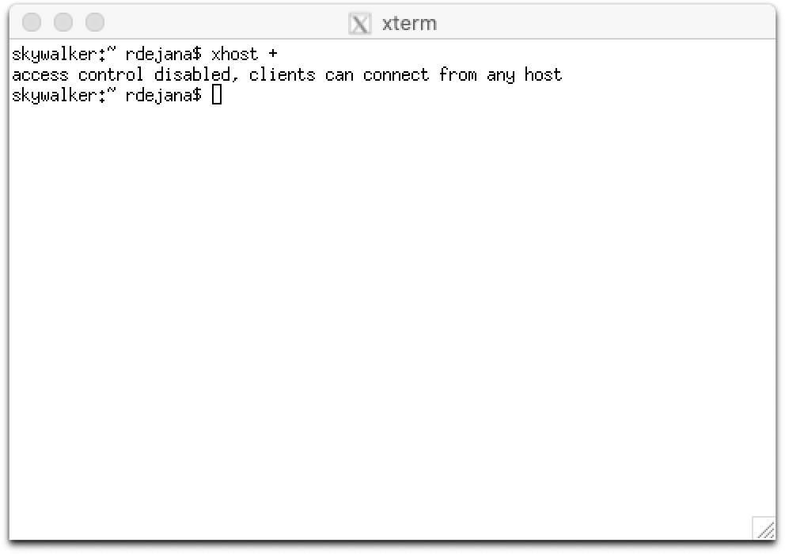
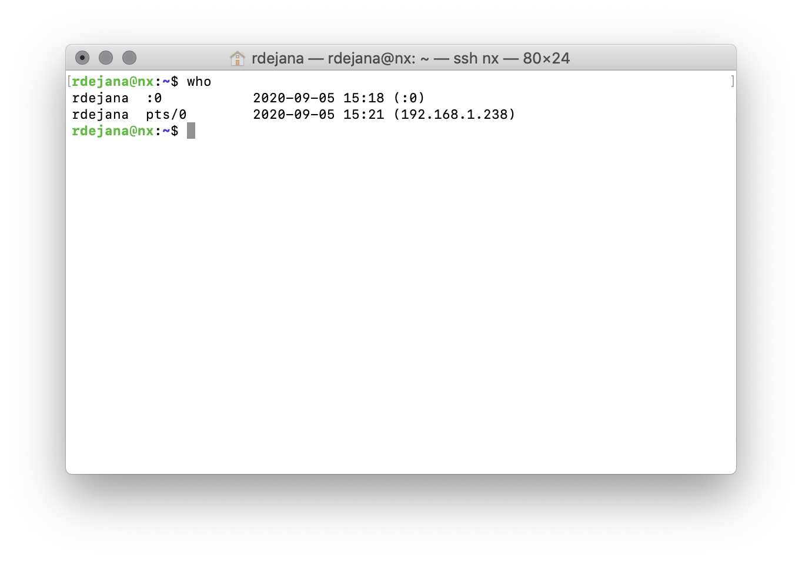
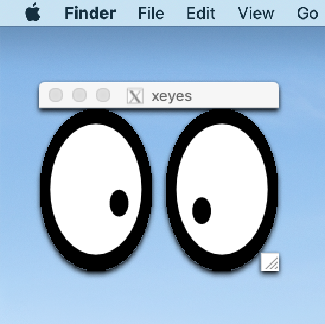
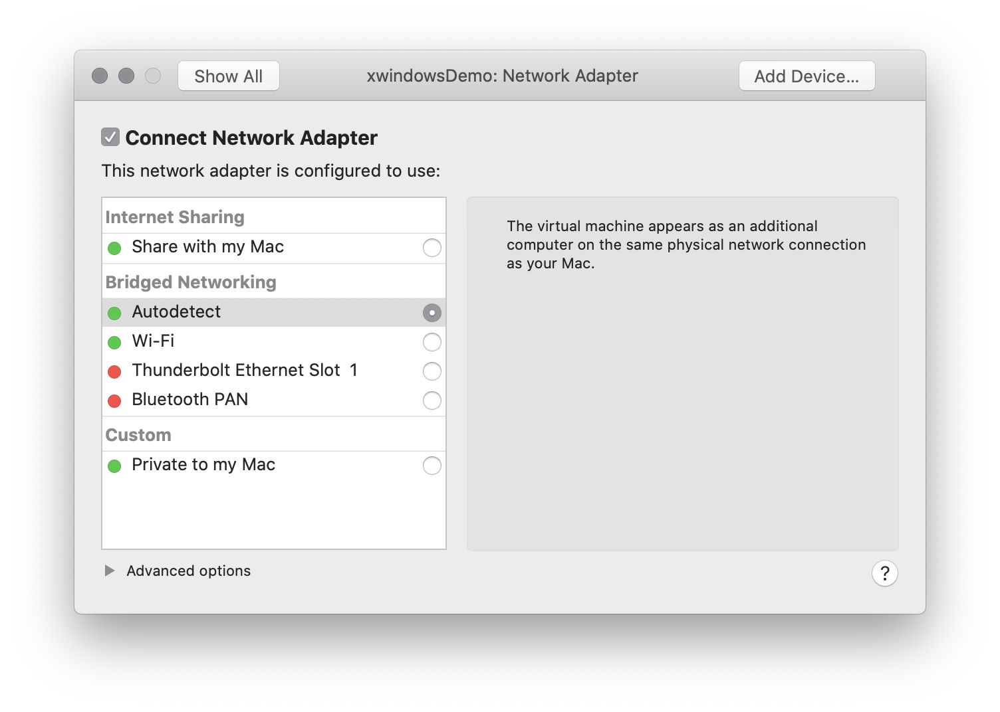
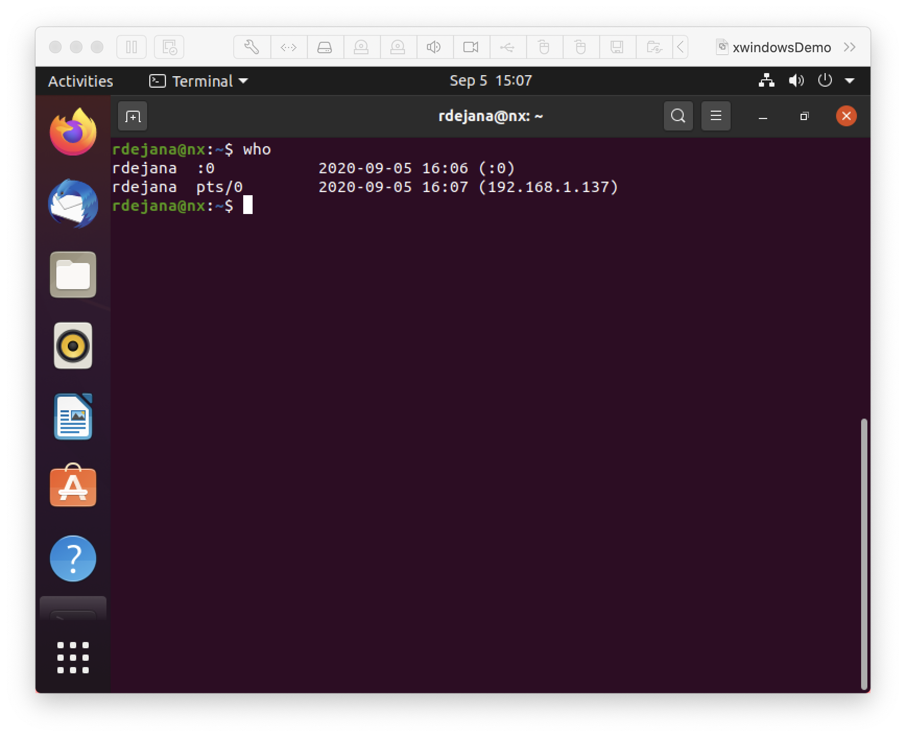
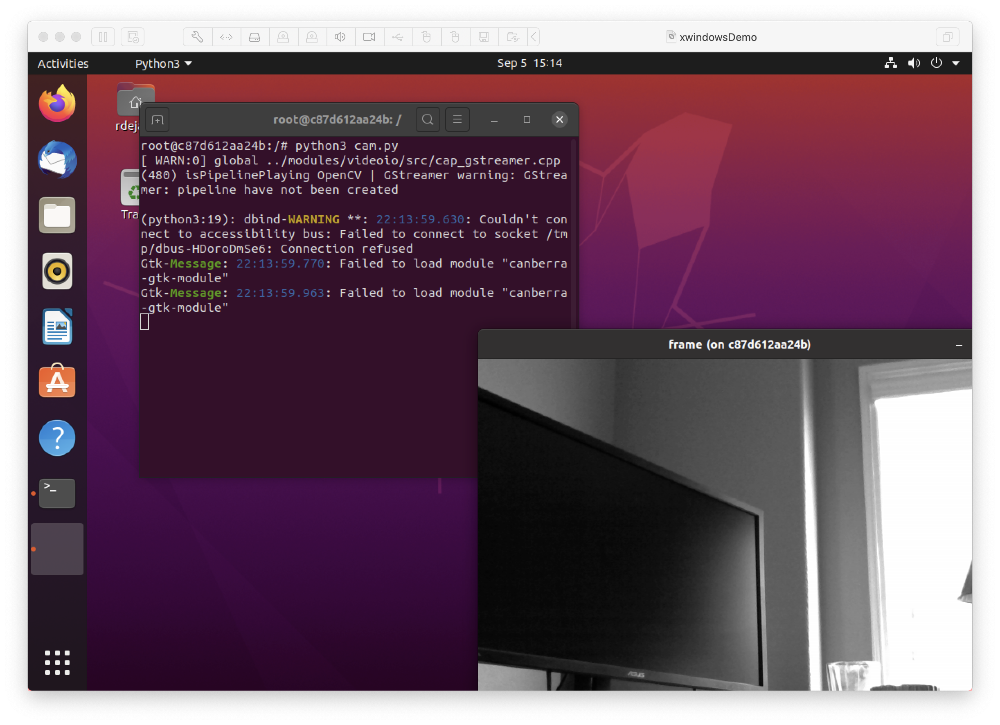

# Using X Windows
X Windows (X11, or simply X) is a windowing system for bitmap displays, common on Unix-like operating systems.  
An interesting feature of X is that it allows the remote display of a window over the network.

The following will cover using X as a means of displaying an UI running on a Jetson device via a macOS or Linux workstation<sup>*</sup> without the need of running your Jeton's desktop and vnc software.

<sup>*</sup> At this time, I do not have a Windows system to text with.  The Linux example will be done as a virtual machine (VM) and such an approach will work with Windows.

## macOS and XQuartz
XQuartz is a X Windows solution for Apple's macOS and will be used for the display.

You'll need to [download](https://www.xquartz.org) and install XQuartz.  

Once installed, start XQuartz and navigate to its prefernce menu (XQuartz, Preferences). Select the security tab and uncheck `Authenticate Connections` and check `Allow connections from network clients`.  


Quit XQuartz (XQuartz, Quit X11) and restart it.

Once XQuartz is running, navigate to (or start via Applications, Terminal if not opened automatically) and enter the command `xhost +`.  This command will need to be run every time your start XQuarz. Note, this window is different than the "normal" macOS termianl and will have the title xterm.



Leave the xterm window open and switch to your normal terminal/shell.  SSH into your Jetson device.  If you do not know the IP address of your workstation, run the command `who`.  In the example below, you can find the workstation IP by looking at the user logged into `pts/0`.  



You'll now run the command `export DISPLAY=workstationIP:0`, replacing `workstationIP` with your workstation's IP address.  For example `export DISPLAY=192.168.1.238:0`.  To text your configration, run the command `xeyes`.


and you should now see a pair of eyes displayed on your desktop.


With the DISPLAY variable correctly set, you can easily see the UI generated from a container. For example, using a container image build from the [HW3 hint](../hw3/README.md), the OpenCV window can easily be displayed on workstation.  


## Ubuntu Linux
This example covers Ubuntu 20 virtual machine (VM) running in VMWare Fusion and the steps will be similar for other distributions, running with another virtualization program (e.g. VirtualBox) or natively.  As a Berkeley student, you get a free VMware subscription [here](https://software.berkeley.edu/vmware). Download and install VMware Workstation (for Windows) or VMware Fusion (for macOS). 

You may download Ubuntu 20 from [here](http://releases.ubuntu.com/focal/ubuntu-20.04.1-desktop-amd64.iso).  Instructions for creating a VM may be found as part of the [week1 homework](https://github.com/MIDS-scaling-up/v2/tree/master/week01/hw).

VM Configuration, the size of the disk should be 40GB absolutely minimum. Give the VM 2-4 cores and at least 4-8G of RAM.  In addition, you will want to make sure that your network is set to be `Bridged` as this gives your VM its own IP address.



By default, Ubuntu 20 does not enable remote X and once your VM is running, you'll need to configure X to allow your Jetson to connect to it.  This is done by editing the file `/etc/gdm3/custom.conf` with the command `sudo vi /etc/gdm3/custom.conf` and adding `DisallowTCP=false` to the `[security]` section.

```
# GDM configuration storage
#
# See /usr/share/gdm/gdm.schemas for a list of available options.

[daemon]
# Uncomment the line below to force the login screen to use Xorg
#WaylandEnable=false

# Enabling automatic login
#  AutomaticLoginEnable = true
#  AutomaticLogin = user1

# Enabling timed login
#  TimedLoginEnable = true
#  TimedLogin = user1
#  TimedLoginDelay = 10

[security]
DisallowTCP=false

```

Reboot you VM.  

Once you have logged back in, open a terminal and verify that X is listening via the command `netstat -a | grep tcp`.  You should see a line similar to 

```
tcp        0      0 0.0.0.0:x11             0.0.0.0:*               LISTEN   
```

If netstat is not installed, it can be installed with the command `sudo apt install net-tools`.

SSH into your Jetson device.  If you do not know the IP address of your linux VM, run the command `who`.  In the example below, you can find the workstation IP by looking at the user logged into `pts/0`.  



You'll now run the command `export DISPLAY=workstationIP:0`, replacing `workstationIP` with your workstation's IP address.  For example `export DISPLAY=192.168.1.238:0`.  To text your configration, run the command `xeyes` and you should now see a pair of eyes displayed on your desktop.


With the DISPLAY variable correctly set, you can easily see the UI generated from a container. For example, using a container image build from the [HW3 hint](../hw3/README.md), the OpenCV window can easily be displayed on workstation.  




